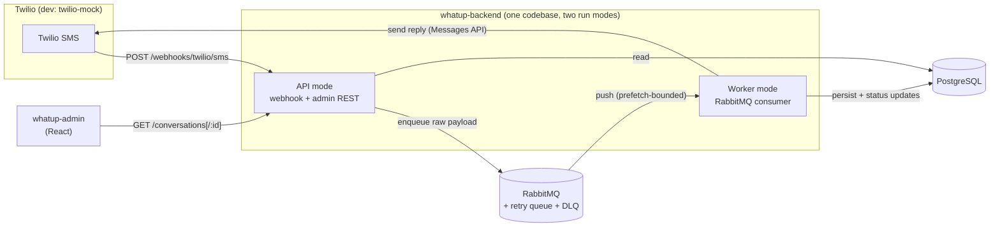
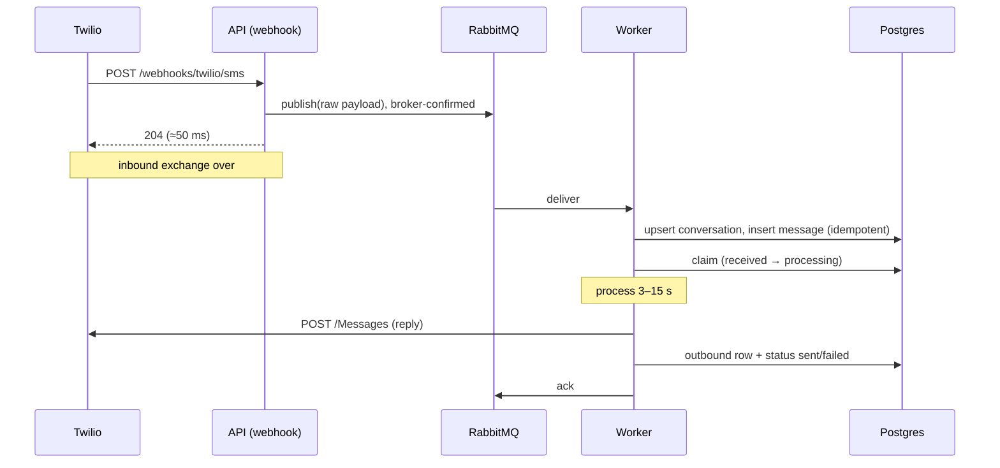

# WhatUp — Technical Design

A conversational SMS system: users text a number, the system processes each
message (3–15 s), and replies by SMS. Admins inspect conversations in a web UI.

**Monorepo layout**

| Package | What it is |
|---|---|
| `whatup-backend/` | NestJS + TypeScript service — webhook ingestion, processing worker, admin REST API |
| `whatup-admin/` | Vite + React admin frontend (read-only conversation viewer) |
| `twilio-mock/` | Express service impersonating Twilio in dev — Messages API + webhook delivery with chaos knobs |

**Stack:** NestJS, PostgreSQL (TypeORM), RabbitMQ, Docker Compose.

---

## 1. System architecture



One NestJS codebase runs in two modes selected by env (`APP_MODE=api|worker`),
so the API and the worker share entities, config, and the Twilio client, but
scale and fail independently.

- **API mode** — receives Twilio webhooks and serves the admin REST API.
- **Worker mode** — consumes RabbitMQ, persists messages, runs the 3–15 s
  processing, sends replies through Twilio.

**System-of-record split:** RabbitMQ is the source of truth for
*work-in-flight*; Postgres is the source of truth for *conversation history*.
This split is what keeps the webhook fast and the system loss-free (§3).

---

## 2. The 5-second webhook timeout

Twilio's webhook allows an inline TwiML reply — return
`<Response><Message>…</Message></Response>` and Twilio sends it for you. **That
path is unusable here:** processing takes 3–15 s and Twilio hangs up at 5 s.
The design is therefore *ack fast, reply later*:



The webhook handler does exactly two things: validate the payload shape and
enqueue it. **It does not touch Postgres.** The 204 is returned in
milliseconds regardless of processing time or database health.

### Why enqueue-first (not persist-first)

The obvious alternative — write the message row, then enqueue, then ack — puts
Postgres on the ack path and creates a dual-write (DB commit + queue publish)
that can half-fail. Enqueue-first was chosen because:

- **Ingestion availability is loss prevention.** Twilio retries a failed
  webhook only a limited number of times, then gives up — permanently. Every
  minute the webhook can't return 2xx is potential permanent message loss.
  With enqueue-first, a full Postgres outage does not stop ingestion: the
  durable queue buffers, workers fail their inserts, failed deliveries come
  back after the retry delay, and everything drains on recovery.
- **No dual-write.** The ack path performs one write to one system. If the
  enqueue fails, we return 500 and Twilio retries — correct behaviour, no
  cleanup needed.

Cost: a message is invisible to the admin UI until a worker persists it
(seconds of latency), and `received` status is recorded at processing time
rather than webhook time. Acceptable for an admin inspection tool.

---

## 3. No message loss — failure walkthrough

| Failure | Outcome |
|---|---|
| API crashes before enqueue | 500 → Twilio retries the webhook |
| Enqueue succeeds, crash before 204 | Twilio retries → duplicate absorbed by idempotency (§4) |
| Worker crashes mid-processing | The broker requeues the unacked delivery as soon as the channel dies → redelivery to another worker |
| Processing throws repeatedly | Each failure is republished to a TTL'd retry queue; after `maxReceiveCount` (3) attempts it is parked in the **DLQ** — nothing is dropped |
| Postgres down | Webhook unaffected; worker inserts fail → messages return to queue and drain after recovery |
| Twilio send API fails | Retry with backoff inside the job; after exhaustion the message row is marked `failed` and remains visible to admins |

The invariant behind all rows: **a delivery is acked only after the outcome
(sent or failed) is durably recorded in Postgres.** Until that point,
at-least-once delivery guarantees somebody will pick it up again.

---

## 4. Idempotency — duplicates are the normal case

Duplicates arrive from two independent sources: Twilio may deliver the same
webhook twice, and queue delivery is at-least-once (requeue-on-crash,
republish-on-retry). Both are absorbed by the same
defences, enforced at the source of truth (Postgres), not in application
memory:

1. **Unique constraint on `messages.provider_message_id`** (the carrier's id
   for the message — Twilio's MessageSid, translated to a neutral name at the
   webhook seam). The worker inserts with `ON CONFLICT DO NOTHING`. A
   duplicate delivery — from either source — resolves to the same row.
2. **Atomic claim before processing.** The worker takes ownership via a
   conditional update:

   ```sql
   UPDATE messages
   SET status = 'processing', claimed_at = now()
   WHERE id = $1
     AND (status IN ('received', 'failed')
          OR (status = 'processing' AND claimed_at < now() - interval '90 seconds'))
   ```

   Zero rows updated means another worker owns the job → drop the delivery
   (ack it) without processing. `failed` is claimable so that a
   queue retry can re-attempt a message whose previous attempt died (e.g. a
   Twilio outage). The stale-claim clause matters: if a worker dies *after*
   claiming, the row would otherwise be stuck in `processing` forever while
   every redelivery bounced off the claim. A claim older than 90 s (far
   beyond the 15 s processing ceiling) is treated as abandoned and taken over.
3. **Reply keyed to the inbound message.** The outbound row carries
   `in_reply_to` with a unique constraint, so all attempts converge on a
   single recorded reply. An attempt that finds the reply already `sent`
   stops; one that finds it unsent retries the send with the recorded body —
   so retries can never produce a second reply row or a different reply text.

**Retry delay: 60 s** (4× worst-case processing) before a failed delivery
returns from the retry queue. RabbitMQ holds an unacked delivery for as long
as the consumer's channel lives, so there is no redelivery-while-slow race to
manage — a worker that dies mid-job is covered by immediate broker requeue
plus the stale-claim takeover, and any residual duplicate hits the claim and
dies there.

### Ordering

Neither Twilio delivery nor a queue consumed concurrently preserves order —
and the system doesn't need it. Replies are per-message, and the admin UI
orders by message timestamp, not arrival. **Single-consumer ordered
consumption was rejected:** it caps throughput, and it can't fix reordering
that happens on Twilio's side anyway. Ordering is a display concern, solved
in the data model.

---

## 5. Data model

```
conversations                          messages
─────────────                          ────────
id            uuid PK                  id              uuid PK
phone_number  text UNIQUE              conversation_id uuid FK → conversations
created_at    timestamptz              provider_message_id text UNIQUE NULL ← idempotency (inbound)
last_message_at timestamptz            direction       'inbound' | 'outbound'
                                       body            text
                                       status          'received' | 'processing' | 'sent' | 'failed'
                                       in_reply_to     uuid UNIQUE NULL FK → messages  ← one reply per inbound
                                       claimed_at      timestamptz NULL   ← stale-claim takeover
                                       created_at      timestamptz
                                       processed_at    timestamptz NULL
```

- A **conversation** is identified by the remote phone number (unique). The
  worker upserts it on first contact.
- **Status is a state machine on the message**, not the conversation:
  `received → processing → sent | failed`. Inbound messages carry the pipeline
  status; outbound rows record the reply and its delivery outcome.
- Indexes: `messages (conversation_id, created_at)` for the conversation view;
  the two unique constraints double as the idempotency mechanism — the
  database is the arbiter of "have I seen this before", so it holds under
  concurrent workers with no coordination.

Postgres over DynamoDB/Mongo: the core read ("conversations by recency, then
all messages in one, ordered, with status") is relational, and unique
constraints give airtight idempotency in one line. TypeORM for the data layer
— decorator entities are Nest-native; the claim query drops to raw SQL, which
TypeORM allows without friction.

---

## 6. API design

| Endpoint | Purpose |
|---|---|
| `POST /webhooks/twilio/sms` | Twilio inbound webhook (form-encoded). Validates, enqueues, returns 204. |
| `GET /conversations` | List conversations, most recent first. |
| `GET /conversations/:id` | Conversation + all messages, oldest first, with per-message status. |
| `GET /conversations/events` | SSE change feed: `{ kind: 'change', conversationId }` on every message write. |

The admin API is **read-only**: the Twilio webhook is the single ingestion
door. The admin-UI composer ("send as a user") posts to twilio-mock's
`POST /simulate/inbound` — the FE plays the phone, the mock plays Twilio —
which delivers the standard Twilio-shaped webhook to the backend. Every
message therefore takes the identical path, carrier → webhook → queue →
worker, chaos knobs included: there is no side door that bypasses the
carrier, and nothing to keep consistent between two ingestion paths. In
production the composer would be pointed at a real test phone/Twilio test
credentials, or dropped — real users text the number.

The read endpoints are the contract consumed by `whatup-admin`, typed once in
the **`whatup-contracts`** workspace package — view shapes, enums, and SSE
event payloads shared by both apps, so contract drift is a compile error on
whichever side breaks it (entities stay out: the contract is the API surface,
not the storage model). The UI re-fetches on SSE change events instead
of polling. Because message rows are written by the worker — potentially a
different process than the API — the feed rides the broker we already run:
after every visible state transition the pipeline publishes the conversation
id to a RabbitMQ **fanout exchange** (`whatup-changes`), and each API
instance consumes from its own exclusive auto-delete queue, so every
instance hears every write regardless of topology. Hints are re-fetch
triggers, not data: delivery is deliberately at-most-once (transient
exchange, no-ack consume, publish failures logged and swallowed) — a lost
hint costs staleness until the next event, never correctness, and can never
fail the message pipeline. At production scale the right mechanism is CDC —
logical replication (e.g. Debezium) feeding a durable log — which catches
every write path with zero cost inside the write transaction and gives
consumers replay; the fanout bus is the honest fit for this system's size.
No auth, per the brief.

**Messaging is behind a technology-agnostic port with swappable drivers, and
dev-Twilio is a separate application.** `MessagingClient` names the
capability, not the vendor; `MESSAGING_DRIVER=twilio|zenvia|fake` selects
which driver (`messaging/drivers/`) the DI container binds, and call sites
never know which. A new provider is one new driver class plus a case in the
`MessagingModule` binding. The HTTP
client's base URL points at real Twilio in production and at **`twilio-mock`**
in dev — a standalone Express service that impersonates both Twilio surfaces:
it accepts the Messages API send call and delivers inbound webhooks to the
backend. Because the mock is a real process across a real network boundary,
the backend exercises its production code path end-to-end, and the mock's
chaos knobs (`WEBHOOK_DUPLICATE_PROB`, `WEBHOOK_MAX_DELAY_MS`) reproduce
Twilio's documented misbehaviour — duplicate delivery, reordering — on
demand, so the idempotency defences can be demonstrated rather than claimed.

---

## 7. Key tradeoffs

| Decision | Alternative | Why, and what it cost |
|---|---|---|
| RabbitMQ | SQS | The broker runs identically in dev and production (no LocalStack emulation), publishes are broker-confirmed before the webhook acks, and unacked deliveries requeue instantly on worker death instead of waiting out a visibility timeout. Cost: retry delay and DLQ are app-asserted topology (TTL'd retry queue + parking queue) rather than managed configuration, and the broker is ours to operate. At-least-once still forces idempotency — which Twilio's duplicate deliveries force anyway. |
| RabbitMQ | pg-boss (queue in Postgres) | pg-boss elegantly deletes the dual-write, and DB death doesn't lose committed jobs. Rejected for *failure-domain coupling*: queue-in-DB welds ingestion availability to Postgres uptime, and queue churn (insert/lock/update/delete per job) is hostile to the OLTP tables sharing the buffer cache. Not rejected for durability — that argument would be wrong. |
| Enqueue-first webhook | Persist-first + queue as doorbell | Keeps Postgres off the ack path; ingestion survives DB outages; no dual-write, no reconciliation sweeper. Cost: seconds of admin-visibility latency. |
| Nest monolith, two run modes | Lambda workers | One deployment model, shared DI/entities, trivial local dev. Cost: we manage worker concurrency ourselves. |
| Fixed retry delay + DB claim | Per-message delay tuning | The claim kills double-processing at the source of truth; a single TTL'd retry queue keeps the topology to three queues with no per-job machinery. |
| RabbitMQ fanout for the SSE change feed | Postgres trigger + LISTEN/NOTIFY; CDC | Reuses the broker already in the stack, keeps events an explicit application concern, and avoids NOTIFY's global commit serialization under load. Cost: only app-driven writes emit hints (a trigger would catch manual SQL too), and delivery is at-most-once — acceptable because hints only trigger re-fetches. For a large-scale production system the choice would be CDC (logical replication → Debezium → durable log): every write path captured, nothing added to the write transaction, replayable consumers. |
| Standalone twilio-mock service | In-process fake only | A separate process exercises the real HTTP client and the real network boundary, and its chaos knobs make duplicate/reordered webhook delivery reproducible. Cost: one more process in dev — kept trivial (single-file Express app). The in-process fake remains for unit tests. |

---

## 8. Testing strategy

- **Unit** — services with in-memory fakes bound through the existing ports
  (queue, reply generator, messaging client): reply generation, status
  transitions, claim logic.
- **Integration** — repositories against real Postgres (Docker): the unique
  constraints and the claim query under concurrent access; these guarantees
  live in the database, so they are tested there.
- **End-to-end** — Docker Compose (API, worker, Postgres, RabbitMQ): post a
  webhook, observe the reply through the fake Twilio client. The critical
  case: *post the same webhook twice, assert exactly one reply and one row.*

---

## 9. Production-scale changes

- **Security:** validate Twilio's `X-Twilio-Signature` on the webhook;
  authenticate the admin API/UI.
- **Scaling:** workers are stateless queue consumers — scale horizontally on
  queue depth (prefetch caps per-worker concurrency); API scales behind a load
  balancer. Postgres gains read replicas for admin traffic long before writes
  are a concern (SMS volume). RabbitMQ itself gains mirrored/quorum queues.
- **Observability:** implemented — OpenTelemetry behind an opt-in OTLP
  endpoint (`docker compose --profile obs up` starts a grafana/otel-lgtm
  container; set `OTEL_EXPORTER_OTLP_ENDPOINT` and open
  http://localhost:3001). Auto-instrumentation traces one request across
  API → RabbitMQ → worker → Postgres → LLM → Twilio (amqplib propagates
  context through message headers — the correlation id for free); custom
  metrics cover outcomes, pipeline/reply latency histograms, and live
  queue/retry/DLQ depths, on a provisioned Grafana dashboard styled with
  the admin UI's palette; logs ship to Loki with trace ids attached (see
  OBSERVABILITY.md). Production would add alerting rules (DLQ > 0, p95
  latency).
- **Delivery status:** subscribe to Twilio status callbacks to track actual
  SMS delivery (`sent` today means "accepted by Twilio", not "delivered").
- **Retries:** replace in-job backoff with per-failure-class retry queues
  (different TTLs); add a small admin action to re-drive DLQ messages.
- **Processing:** implemented — `REPLY_DRIVER=claude` swaps the simulated
  step for real LLM replies (Claude Haiku through the Claude Agent SDK behind
  the ReplyGenerator port; 60 s abort kept well under the stale-claim
  threshold). Production would move to direct API billing (Messages API) and
  add circuit breaking; the Agent SDK path suits the demo's
  subscription-billing constraint.
