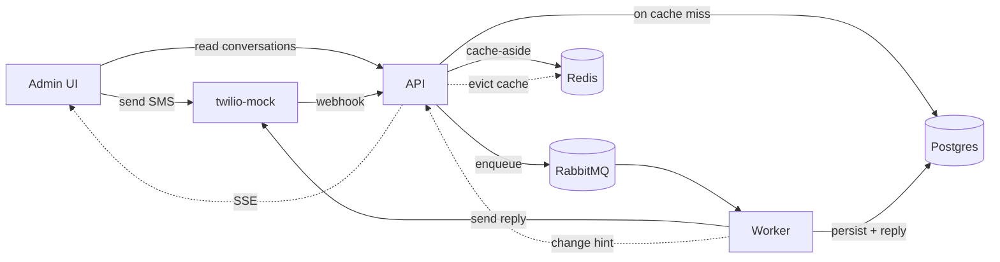

<p align="center">
  
</p>

<h1 align="center">WhatUp</h1>

<p align="center"><em>What if WhatsApp and iMessage had a child?</em></p>

<p align="center">
  Meet WhatUp: it inherited its mother's obsession with being on every phone on Earth
  and its father's refusal to make anything that isn't a blue bubble.
  It's SMS, which means it also inherited something from a grandparent nobody talks about.
</p>

---

WhatUp is a conversational SMS platform. You text it, it thinks about what you said for
3-15 seconds (it was raised to think before it speaks), and it texts you back. Every
message. Always. Exactly once. An admin web app lets you watch every conversation update
live, like a helicopter parent with a dashboard.

## Demo

<!-- ────────────────────────────────────────────────────────────────────────
  RESERVED: demo videos.
  GitHub renders videos that are uploaded through the web editor. Open this
  file on github.com, click the pencil, and drag each .mp4/.mov onto the line
  below its heading. GitHub replaces it with a hosted user-attachments URL.
──────────────────────────────────────────────────────────────────────── -->

### The application

<!-- Drop the Admin UI walkthrough video here: composer → 3-15 s "processing" → reply arrives live via SSE. -->

*Video coming soon.*

### The observability dashboard

<!-- Drop the Grafana walkthrough video here: the WhatUp Overview dashboard, a trace end-to-end, trace-correlated logs. -->

*Video coming soon.*

## Features

- **Guaranteed replies.** Every inbound SMS receives a reply within 3-15 seconds.
- **No message loss.** Failed processing is retried with a delay; after three attempts
  the message is parked in a dead-letter queue for inspection. Nothing is dropped.
- **Duplicate-safe.** Whether a message is sent twice or the carrier delivers it twice,
  Postgres constraints guarantee exactly one reply per inbound message. The mock carrier
  deliberately duplicates webhook deliveries to exercise this path.
- **Live admin UI.** Every conversation updates in real time over Server-Sent Events:
  message arrival, processing status, and the reply, without polling.
- **Cached reads.** Admin list and detail responses are served cache-aside from Redis,
  invalidated by the same change events that drive the live UI.
- **Optional AI replies.** Set `REPLY_DRIVER=claude` to generate replies with Claude
  instead of the built-in keyword bot.
- **Full observability.** Traces, metrics, and logs for every message's journey, with a
  provisioned Grafana dashboard. See [OBSERVABILITY.md](docs/OBSERVABILITY.md).

## How it works

Every message, including the ones sent from the admin UI, travels through the (mock)
carrier: there is a single ingestion path.



The webhook answers in milliseconds and enqueues; the worker claims each message
atomically, generates the reply, sends it back through the carrier, and records
everything in Postgres, which is the arbiter of idempotency, ordering, and truth.
Admin reads are served cache-aside from Redis, falling through to Postgres on a
miss; the change hints that drive the SSE stream also evict the affected cache
keys. The full architecture, trade-offs, and failure walkthroughs live in
[DESIGN.md](docs/DESIGN.md).

## Tech stack

| Layer | Tech |
| --- | --- |
| Backend | [NestJS](https://nestjs.com) 11 on Node 20+, TypeScript end to end |
| Database | PostgreSQL 16 with [TypeORM](https://typeorm.io): entities for schema, raw SQL where the guarantees live |
| Queueing | RabbitMQ 4 via `amqplib`: a durable work queue for the pipeline, a fanout exchange for live updates |
| Cache | Redis 7 behind a `CacheStore` port; an in-memory driver is available via `CACHE_DRIVER=memory` |
| Frontend | React 19 + Vite, live-updated over Server-Sent Events (`EventSource`) |
| Shared types | `whatup-contracts`, an npm-workspaces package both apps import, so the wire contract is a compile error, not a runtime surprise |
| Carrier | Express (`twilio-mock`), implementing Twilio's webhook and Messages API surfaces |
| AI replies | [Claude Agent SDK](https://code.claude.com/docs/en/agent-sdk) (`REPLY_DRIVER=claude`) |
| Observability | OpenTelemetry SDK (auto-instrumented http/express/pg/amqplib + custom spans and metrics) → [grafana/otel-lgtm](https://github.com/grafana/docker-otel-lgtm): Grafana, Prometheus, Tempo, Loki in one container |
| Infra | Docker Compose for Postgres, RabbitMQ, Redis, and the observability stack |
| Quality | Jest (unit + integration suites), ESLint + Prettier, `class-validator` at the HTTP boundary |

## Engineering concepts

WhatUp is a distributed-systems exercise underneath, and these are the ideas doing the
work, each one detailed in [DESIGN.md](docs/DESIGN.md):

- **Enqueue-first ingestion.** The webhook validates and enqueues, with no database in
  the path, so it answers in milliseconds, survives a Postgres outage, and beats carrier
  webhook timeouts. If the broker is down it returns 500 and the carrier retries: the
  failure mode is the retry mechanism. (§2)
- **Idempotency, because duplicates are the normal case.** Carriers re-POST, queues
  redeliver, workers crash mid-flight. Three Postgres constraints make all of it safe: a
  unique `provider_message_id` collapses duplicate deliveries onto one row, an atomic
  claim (`UPDATE … WHERE status IN (…)`) lets exactly one worker process it, and a unique
  `in_reply_to` guarantees at most one reply per inbound message. The database is the
  arbiter, not application memory. (§4)
- **Retries with delay.** A failed delivery is republished to a TTL retry queue whose
  expiry dead-letters it back to the main queue: redelivery-after-delay without a
  scheduler. (§3)
- **Dead-letter queue.** After three failed attempts the message is parked in
  `whatup-inbound.dlq` with its attempt history: never dropped, never poison-looping,
  available to an operator. (§3)
- **Stale-claim takeover.** A worker that dies after claiming a message holds the claim
  only for `STALE_CLAIM_SECONDS`; after that any worker may take the row over. Crashed
  workers don't strand messages. (§4)
- **Ports & adapters.** The application depends on `MessageQueue`, `MessagingClient`,
  `ReplyGenerator`, `ChangeEventBus`, and `CacheStore` interfaces; RabbitMQ,
  Twilio/Zenvia/fake, Claude/fake, and Redis/memory are swappable drivers behind DI
  tokens. Repositories own all SQL; adapters translate rows at every boundary. (§6)
- **Live updates without polling.** Every write publishes a data-free *change hint* to a
  RabbitMQ fanout exchange; every API instance forwards it to its SSE clients, which
  re-fetch. Hints are best-effort by contract: losing one costs staleness, never
  correctness. At production scale this becomes CDC. (§6, §9)
- **Cache-aside with event-driven invalidation.** The admin read path is cached in
  Redis; the same change hints that drive the SSE stream evict the affected keys, and a
  TTL bounds staleness if a hint is missed. Cache operations are best-effort: an
  unreachable Redis degrades to uncached reads, never to failed requests. Idempotency
  and claims are never cached. (§6)
- **Horizontal scaling.** One codebase, `APP_MODE=api|worker|all`, so ingestion and
  processing scale independently; prefetch bounds per-worker concurrency. (§1, §9)
- **Observability as a feature.** One distributed trace follows a message from webhook
  through the queue (context propagated in message headers) to reply generation and the
  outbound send; RED-style metrics (throughput by outcome, latency histograms, queue
  depths) and trace-correlated logs land in a provisioned Grafana dashboard.
  ([OBSERVABILITY.md](docs/OBSERVABILITY.md))
- **Tested where the guarantees live.** Unit tests mock the ports; integration tests hit
  real Postgres to prove the concurrency invariants (concurrent duplicate deliveries
  converge on one row, exactly one claimer wins), because those guarantees are enforced
  by the database, not the application. (§8)

## Repository layout

| Package | What it is |
| --- | --- |
| [`whatup-backend`](whatup-backend) | NestJS API and worker (one codebase, `APP_MODE` selects the role) |
| [`whatup-admin`](whatup-admin) | React admin UI |
| [`twilio-mock`](twilio-mock) | Standalone Twilio impersonator so the full carrier loop runs locally |
| [`whatup-contracts`](whatup-contracts) | Shared TypeScript types for the API wire contract |
| [`observability/`](observability) | Grafana dashboard and datasource provisioning |

## Quickstart

You need **Node 20+** and **Docker**.

```bash
npm install                                    # installs all workspaces, builds the shared contracts
cp whatup-backend/.env.example whatup-backend/.env
npm run dev                                    # postgres + rabbitmq + redis (docker) + backend + twilio-mock + admin UI
```

Then open:

| URL | What's there |
| --- | --- |
| http://localhost:5173 | Admin UI |
| http://localhost:3000 | Backend API (webhook + read-only admin endpoints + SSE) |
| http://localhost:4010 | twilio-mock |
| http://localhost:15672 | RabbitMQ management (`whatup` / `whatup`) |

### Send your first message

Use the composer in the admin UI, which plays the role of the phone. Or deliver an
inbound message as the carrier would:

```bash
curl -X POST http://localhost:4010/simulate/inbound \
  -H 'Content-Type: application/json' \
  -d '{"from": "+15550001111", "body": "hello?"}'
```

The conversation appears in the UI, shows *processing…* for 3-15 seconds, and receives
its reply. The default reply driver responds to the keywords `BOOK` and `CANCEL` and
echoes anything else; set `REPLY_DRIVER=claude` in `whatup-backend/.env` for LLM-generated
replies (see the notes in `.env.example`).

### Observability

```bash
npm run obs        # Grafana + Prometheus + Tempo + Loki, one container
```

Grafana is at http://localhost:3001, and the **WhatUp Overview** dashboard is the home
page: throughput, reply latency, queue depths, live traces, and trace-correlated logs.
Setup, credentials, and troubleshooting are in [OBSERVABILITY.md](docs/OBSERVABILITY.md).

### Tests

```bash
npm test                    # unit suite (mocked ports and adapters)
npm run test:integration    # repository guarantees against real Postgres, in a throwaway whatup_test DB
```

### All the scripts

| Command | What it does |
| --- | --- |
| `npm run dev` | Start everything (infra + backend + twilio-mock + admin) |
| `npm run obs` / `npm run obs:down` | Start / stop the observability stack (Grafana data survives) |
| `npm run db:purge` | Wipe messages, conversations, queues, and cache |
| `npm test` | Unit tests |
| `npm run test:integration` | Integration tests against real Postgres |

---

<p align="center">
  <sub>
    WhatUp is a parody project and is not affiliated with WhatsApp (Meta) or iMessage
    (Apple). It originated as a take-home technical assessment; the original brief is in
    <a href="docs/ASSESSMENT.md">ASSESSMENT.md</a> and the technical design in
    <a href="docs/DESIGN.md">DESIGN.md</a>.
  </sub>
</p>
