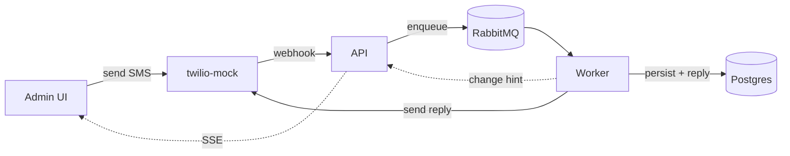

<p align="center">
  
</p>

<h1 align="center">WhatUp</h1>

<p align="center"><em>What if WhatsApp and iMessage had a child?</em></p>

<p align="center">
  Meet WhatUp: it inherited its mother's obsession with being on every phone on Earth
  and its father's refusal to make anything that isn't a blue bubble.
  It's SMS, which means it also inherited something from a grandparent nobody talks about.
</p>

---

WhatUp is a conversational SMS platform. You text it, it thinks about what you said for
3–15 seconds (it was raised to think before it speaks), and it texts you back. Every
message. Always. Exactly once. An admin web app lets you watch every conversation update
live, like a helicopter parent with a dashboard.

## Demo

<!-- ────────────────────────────────────────────────────────────────────────
  RESERVED: demo videos.
  GitHub renders videos that are uploaded through the web editor — open this
  file on github.com, click the pencil, and drag each .mp4/.mov onto the line
  below its heading. GitHub replaces it with a hosted user-attachments URL.
──────────────────────────────────────────────────────────────────────── -->

### The app

<!-- Drop the UI walkthrough video here: composer → 3–15 s "processing" → reply arrives live via SSE. -->

*Video coming soon — the child is camera-shy.*

### The observability dashboard

<!-- Drop the Grafana walkthrough video here: WhatUp — Overview dashboard, a trace end-to-end, trace-correlated logs. -->

*Video coming soon — yes, we film our own dashboard. We watch our messages harder than you watch yours.*

## Features

- **Blue bubbles for everyone.** No green-bubble caste system. Every conversation gets the
  gradient. This was a custody condition.
- **It always texts back.** Send an SMS, get a reply in 3–15 seconds. Needy? Yes.
  Unreliable? Never.
- **It never loses a message.** Failed processing is retried with a delay, and after three
  strikes the message is sent to the dead-letter queue, which is like therapy for
  messages. Nothing is dropped; some things just need time.
- **Double-texting is safe.** Send the same message twice, or let the carrier deliver it
  twice — Postgres constraints make sure exactly one reply goes out. WhatUp does not
  double-text. It has that from neither parent. (Our mock carrier randomly duplicates
  webhook deliveries *on purpose*, because real carriers do it by accident.)
- **A helicopter-parent admin UI.** Every conversation, live-updated over SSE. You see the
  message arrive, you see it *processing…*, you see the reply. Read receipts for the
  read receipts.
- **Optional AI replies.** Flip `REPLY_DRIVER=claude` and the replies come from Claude
  instead of the built-in keyword bot. The child is gifted.
- **Fully observed.** Traces, metrics, and logs for every message's journey, with a
  provisioned Grafana dashboard. See [OBSERVABILITY.md](OBSERVABILITY.md).

## How it works

Every message — including the ones you send from the admin UI — travels through the
(mock) carrier. Nobody skips the line.



The webhook answers in milliseconds and enqueues; the worker claims each message
atomically, generates the reply, sends it back through the carrier, and records
everything in Postgres — which is the arbiter of idempotency, ordering, and truth.
The full architecture, trade-offs, and failure walkthroughs live in
[DESIGN.md](DESIGN.md).

## The family tree

| Package | What it is |
| --- | --- |
| [`whatup-backend`](whatup-backend) | NestJS API + worker. The responsible one. |
| [`whatup-admin`](whatup-admin) | React admin UI. Got its father's looks. |
| [`twilio-mock`](twilio-mock) | A tiny Twilio impersonator so you can run the whole carrier loop locally. Legally distinct. |
| [`whatup-contracts`](whatup-contracts) | Shared TypeScript types, so the frontend and backend never argue about what a message is. |
| [`observability/`](observability) | Grafana dashboard + datasource provisioning. The family photo album. |

## Quickstart

You need **Node 20+** and **Docker**.

```bash
npm install                                    # installs all workspaces, builds the shared contracts
cp whatup-backend/.env.example whatup-backend/.env
npm run dev                                    # postgres + rabbitmq (docker) + backend + twilio-mock + admin UI
```

Then open:

| URL | What's there |
| --- | --- |
| http://localhost:5173 | Admin UI — pick a phone number and start texting |
| http://localhost:3000 | Backend API (webhook + read-only admin endpoints + SSE) |
| http://localhost:4010 | twilio-mock |
| http://localhost:15672 | RabbitMQ management (`whatup` / `whatup`) |

### Send your first message

Use the composer in the admin UI — you're playing the phone. Or be the carrier yourself:

```bash
curl -X POST http://localhost:4010/simulate/inbound \
  -H 'Content-Type: application/json' \
  -d '{"from": "+15550001111", "body": "hello?"}'
```

Watch the conversation appear in the UI, sit in *processing…* for 3–15 seconds, and get
its reply. The default reply bot understands `BOOK` and `CANCEL` and politely echoes
everything else. It is not a good conversationalist. That's what the Claude driver is for
(`REPLY_DRIVER=claude` in `whatup-backend/.env` — see the notes in `.env.example`).

### Watch it being watched

```bash
npm run obs        # Grafana + Prometheus + Tempo + Loki, one container
```

Grafana is at http://localhost:3001 — the **WhatUp — Overview** dashboard is the home
page: throughput, reply latency, queue depths, live traces, and trace-correlated logs.
Full tour, credentials, and troubleshooting in [OBSERVABILITY.md](OBSERVABILITY.md).

### Tests

```bash
npm test                    # unit suite (mocked ports and adapters)
npm run test:integration    # repository guarantees against real Postgres, in a throwaway whatup_test DB
```

### All the scripts

| Command | What it does |
| --- | --- |
| `npm run dev` | Start everything (infra + backend + twilio-mock + admin) |
| `npm run obs` / `npm run obs:down` | Start / stop the observability stack (Grafana data survives) |
| `npm run db:purge` | Wipe messages, conversations, and queues — a fresh start, no questions asked |
| `npm test` | Unit tests |
| `npm run test:integration` | Integration tests against real Postgres |

---

<p align="center">
  <sub>
    WhatUp is a parody and is not affiliated with, endorsed by, or texting either of its
    parents (Meta's WhatsApp or Apple's iMessage). It was born as a take-home technical
    assessment — the original brief lives in <a href="ASSESSMENT.md">ASSESSMENT.md</a>,
    and the engineering it grew into lives in <a href="DESIGN.md">DESIGN.md</a>.
  </sub>
</p>
